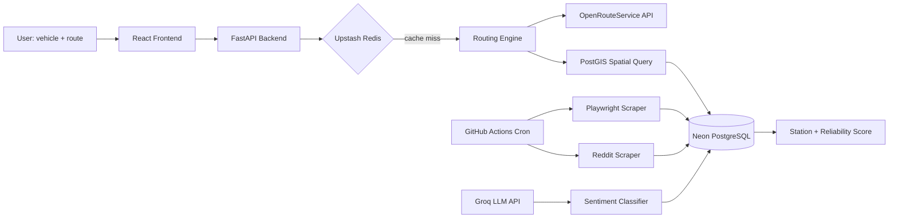

# EV Route Planner 🔋🚗

An end-to-end electric vehicle route planning application with NLP-scored charging station recommendations based on qualitative reviews.

## Technical Architecture



## Tech Stack Overview

- **Frontend**: React (TypeScript), Leaflet, OpenStreetMap
- **Backend**: FastAPI (Python), Uvicorn
- **Database**: PostgreSQL with PostGIS extension (hosted on Neon)
- **Cache**: Redis (hosted on Upstash)
- **NLP / ML**: Groq API (LLaMA 3) for sentiment classification
- **Routing**: OpenRouteService API + PostGIS spatial queries
- **CI/CD**: GitHub Actions

---
*Note: This project is currently a Work in Progress.*
---

## Local Setup

### Backend Setup
1. Clone the repository and navigate to the backend directory:
   ```bash
   cd backend
   ```
2. Create and activate a virtual environment:
   ```bash
   python -m venv venv
   # On Windows
   venv\Scripts\activate
   ```
3. Install dependencies:
   ```bash
   pip install -r requirements.txt
   ```
4. Copy the `.env.example` file and fill in your API keys:
   ```bash
   cp .env.example .env
   ```
5. Run the server:
   ```bash
   uvicorn app.main:app --reload --port 8000
   ```

### Frontend Setup
1. Navigate to the frontend directory:
   ```bash
   cd ../frontend
   ```
2. Install Node dependencies:
   ```bash
   npm install
   ```
3. Start the application:
   ```bash
   npm start
   ```

## License
MIT License
